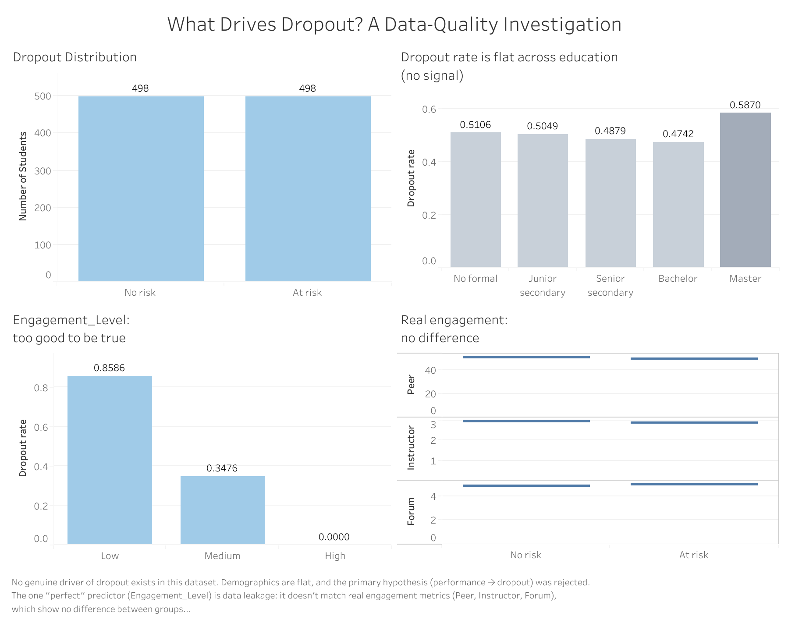

# Adult Vocational Education: Course Satisfaction & Dropout Analysis
### …or: What Drives Dropout? A Data-Quality Investigation

> A portfolio data analytics project that set out to find what drives student dropout in adult vocational education — and instead proved that the dataset contains **no genuine early predictors**, that its one "perfect" predictor is **data leakage**, and that the data itself is **synthetic**. Built on the Google Data Analytics six-phase framework (Ask, Prepare, Process, Analyze, Share, Act).

**Tools:** SQL (BigQuery) · Excel · Tableau
**Dataset:** [Dropout Risk dataset (Kaggle, llovek)](https://www.kaggle.com/datasets/llovek/dropout-risk) — 1,000 rows, 28 columns

---

## ⚡ TL;DR — Key Findings

| # | Finding | Evidence |
|---|---|---|
| 1 | **Performance does not predict dropout** (primary hypothesis H1 rejected) | Avg. assessment score: 70.6 (stayed) vs 69.5 (dropped) — a 1.1-pt gap |
| 2 | **Real engagement does not predict dropout** (H2 rejected) | Peer 51.1 vs 49.6, Instructor 3.01 vs 2.92, Forum 4.90 vs 5.03 — all flat |
| 3 | **`Engagement_Level` is data leakage** | Shows an extreme 86% → 35% → 0% dropout gradient, yet is uncorrelated with every real engagement metric — it was generated jointly with the target, not derived from behavior |
| 4 | **The dataset is synthetic** | Target split is a perfect 498/498; demographics, income, satisfaction all flat vs dropout |
| 5 | **Early-warning segmentation is impossible on this data** | The only separating variable (`Course_Completion_Rate`) is tautological with dropout and only known mid-course |

**The honest headline:** the most valuable deliverable of this analysis is the proof that *no model or intervention program should be built on this dataset* — plus a documented method for catching that early.

---

## 🎯 Business Question

> What student characteristics, learning behaviors, and engagement patterns are most strongly associated with dropout risk in adult vocational education — and how can institutions use these signals to intervene early?

**What the project actually answered:** none of the recorded characteristics are genuinely associated with dropout in this dataset, and the apparent signals are artifacts. The project therefore doubles as a case study in data validation, leakage detection, and honest reporting of null results.

---

## 🧠 Why This Project

I taught English as a second language for 7 years, working primarily with adult learners. This background drives a direct interest in **why adults disengage from learning** — and how data can help education providers retain and support them. The project combines that domain experience with a structured analytics approach for a Junior Data Analyst portfolio.

That same domain experience is what raised the first red flag: a "perfect" engagement predictor with a 0% dropout rate in its top tier does not exist in real adult education.

---

## 📁 Repository Structure

```
vocational-education-dropout-analysis/
│
├── README.md                          ← this file
├── data/
│   └── analysis_ready.csv             ← final analysis-ready dataset (996 rows)
├── docs/
│   ├── data_dictionary.md             ← column descriptions & encoding assumptions
│   └── project_log.docx               ← decision log across project phases
├── sql/
│   ├── 03_exploratory_queries.sql     ← EDA queries (Q1–Q5, findings in comments)
│   └── 04_analysis_queries.sql        ← hypothesis testing H1–H4 + segmentation (Q6–Q10)
└── tableau/
    └── screenshots/
        └── dashboard.png              ← dashboard preview
```

The original raw dataset is not redistributed here — download it directly from [Kaggle](https://www.kaggle.com/datasets/llovek/dropout-risk).

---

## 🔍 Phase 1 — Ask

**Business task:** identify factors associated with student dropout risk in adult vocational education.

**Stakeholders:** Academic Director, Course Designers, Student Success Team, Marketing.

**Primary hypothesis (H1):** students with weaker intermediate performance signals (lower assessment scores, lower study efficiency) show higher dropout risk — dropout behaves partly as a defensive reaction to anticipated failure.

**Secondary hypotheses:**
- **H2** — lower instructor and peer interaction increases dropout risk independently of performance
- **H3** — satisfaction and dropout are *not* perfectly inversely linked
- **H4** — employment status and income moderate the performance→dropout relationship

Full guiding questions and decision rationale: [docs/project_log.docx](docs/project_log.docx).

---

## 🧹 Phase 2 — Prepare

- **Source:** Kaggle dataset (llovek/dropout-risk), 1,000 rows × 28 columns, 0 duplicates, < 3% missing per column
- **Data dictionary:** not provided by author → reconstructed via domain knowledge + statistical inference, documented in [docs/data_dictionary.md](docs/data_dictionary.md)
- **Outreach to author:** a Kaggle discussion topic was posted requesting encoding details and feature-engineering formulas (no response at time of writing)
- **Storage:** Excel for exploration + Google BigQuery for SQL analysis

### Key data-quality findings (first warning signs)

- Severe outliers in two engineered features (`Study_Efficiency` max ≈ 97,540; `Assessment_Intensity` max ≈ 20,000) — traced to division-by-near-zero artifacts in the original feature engineering
- All categorical columns numerically encoded without a key
- Five columns flagged as *suspected engineered features* (`Study_Efficiency`, `Assessment_Intensity`, `Interaction_Score`, `Engagement_Level`, `Course_Satisfaction_Level`) — carried forward as a leakage risk to monitor in Analyze

---

## ⚙️ Phase 3 — Process

- Dropped rows with missing target values → **996 rows** in the analysis-ready dataset ([data/analysis_ready.csv](data/analysis_ready.csv))
- Imputed remaining missing values (median for numeric / mode for categorical) with `was_missing_*` audit flags
- Recomputed engineered features with denominator guards to remove divide-by-near-zero outliers (original values remain available in the raw Kaggle dataset)
- Decoded categorical columns into human-readable labels per the documented encoding assumptions
- Loaded the cleaned table into BigQuery (`dropout_project.students`) for SQL analysis

---

## 📈 Phase 4 — Analyze

All queries with findings-as-comments: [`sql/03_exploratory_queries.sql`](sql/03_exploratory_queries.sql), [`sql/04_analysis_queries.sql`](sql/04_analysis_queries.sql).

### EDA red flags

- **Q1:** target variable splits *exactly* 498/498 — real-world dropout almost never balances perfectly; first strong hint of synthetic data
- **Q2–Q3:** dropout rate flat across gender (51% vs 47%) and education levels (47–51%; the Master group's 59% rests on n=46)
- **Q4:** `Course_Completion_Rate` shows the only strong gradient (76% → 0% dropout) — but completion and dropout are near-tautological measures of the same thing
- **Q5:** `Engagement_Level` shows an extreme 86% → 35% → 0% gradient — flagged for leakage verification

### Hypothesis testing

| Hypothesis | Verdict | Evidence |
|---|---|---|
| **H1** — weaker performance → higher dropout | ❌ Rejected | Scores near-identical (70.6 vs 69.5); efficiency even slightly *higher* for dropouts |
| **H2** — lower interaction → higher dropout | ❌ Rejected | Peer, instructor, and forum metrics all flat between groups |
| **H3** — satisfaction ≠ inverse of dropout | ✅ Supported (trivially) | Satisfaction 3.49 vs 3.41 — no link at all, consistent with H3 but reflecting the dataset's overall lack of real relationships |
| **H4** — income/employment moderate H1 | ❌ Rejected | Dropout flat across income tiers (0.49–0.51); no effect to moderate |

### The leakage proof (core finding)

`Engagement_Level` predicts dropout almost perfectly (86% → 0%), yet the *actual* engagement metrics it should be derived from — `Peer_Interaction_Score`, `Instructor_Interaction_Frequency`, `Forum_Participation` — show **no difference** between dropout groups. Conclusion: `Engagement_Level` was generated jointly with `Dropout_Risk` from a shared latent factor, not computed from behavior. It was **excluded as a predictor** and reported only as a leakage case study.

### Risk segmentation attempt

Segmentation by `Course_Completion_Rate` does separate groups (60% / 43% / 20% dropout), but it is tautological — completion *is* (non-)dropout in progress form, and it's only observable mid-course. With demographics and engagement flat, **no actionable early-warning segmentation is possible on this dataset**.

---

## 📊 Phase 5 — Share

**Dashboard:** *What Drives Dropout? A Data-Quality Investigation* —https://public.tableau.com/views/DropoutAnalysisDashboard/Dashboard1?:language=en-US&:sid=&:redirect=auth&:display_count=n&:origin=viz_share_link



The dashboard is built as a four-panel argument rather than a KPI display:
1. **Dropout Distribution** — the suspicious 498/498 balance
2. **Dropout rate across education** — a representative "flat" demographic (no signal)
3. **Engagement_Level: too good to be true** — the leaked variable's impossible gradient
4. **Real engagement: no difference** — the flat behavioral metrics that expose the leak

---

## 🎬 Phase 6 — Act

Recommendations reframed for the data-quality reality:

**For any team considering this dataset (or similar Kaggle sources):**
- Do not train dropout-prediction models on it; the only strong predictors are leakage or tautology
- Run a leakage check before modeling: verify that every engineered/bucketed feature actually reconstructs from its claimed raw inputs
- Treat a perfectly balanced binary target as a prompt to investigate data provenance

**For a real institution wanting genuine early-warning capability (follow-up data collection):**
- Log *time-stamped* early-stage behavioral events (first-week logins, assignment submission latency, session frequency) — the early predictors this dataset lacks
- Record actual dropout events with dates, not a derived risk label
- Keep raw behavioral metrics and any derived scores in separate, documented pipelines to make leakage auditable

**Process recommendations for portfolio/junior analysts:**
- Document encoding assumptions when a data dictionary is missing, and attempt author contact (done here via a Kaggle discussion topic)
- Report null results honestly: "no signal" backed by evidence is a finding, not a failure

---

## ⚠️ Limitations & Assumptions

1. `Dropout_Risk` is a **derived risk label**, not a recorded dropout event; all findings describe the dataset's internal structure, not real-world causality.
2. The dataset is almost certainly **synthetic** (perfect class balance, uniformly flat relationships, jointly generated target and predictor). Conclusions about adult-education dropout drivers **cannot** be drawn from it — only conclusions about the data itself.
3. Encoding assumptions for categorical columns are documented but unverified by the dataset author (no response to the Kaggle inquiry at time of writing).
4. Engineered features with severe outliers were recomputed; the original values remain available in the raw Kaggle dataset.
5. Full moderation testing for H4 (score × income interaction) was simplified to direct-effect checks — justified, since no direct effects existed to moderate.

---

## 💡 What I Learned

- **Validate before you analyze:** distribution checks (Q1) and engineered-feature audits caught problems that would have invalidated every downstream conclusion
- **Leakage detection is a testable claim:** "this feature is derived from behavior" can be verified by checking it against the behavior — and here it failed
- **Null results have business value:** telling a stakeholder "don't build on this data, and here's what to collect instead" prevents a costly wrong turn
- **Domain knowledge is a data-quality tool:** 7 years with adult learners is why "0% dropout in the high-engagement tier" immediately read as impossible

---

## 👤 Author

Yana Yurevich — aspiring Junior Data Analyst, with 7 years of prior experience as an English teacher for adult learners.
www.linkedin.com/in/yana-yurevich-📎-2185913a6 · yana.yurevich@icloud.com
